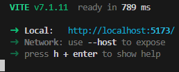

<br/>
<p align="center">
  <a href="https://github.com/fpasqu/kp2comparator">
    
  </a>

  <h3 align="center">ebay-clone</h3>

  <p align="center">
    Replica of eBay.it
    <br/>
    <br/>
    <a href="https://github.com/fpasqu/ebay-clone/issues">Report Bug</a>
    .
    <a href="https://github.com/fpasqu/ebay-clone/issues">Request Feature</a>
  </p>
</p>

  
 

## Table Of Contents

- [Table Of Contents](#table-of-contents)
- [About The Project](#about-the-project)
- [Prerequisites](#prerequisites)
- [Usage](#usage)
- [License](#license)
- [Authors](#authors)

## About The Project

This project is an eBay-style marketplace application built to showcase component-based architecture, state management, reusable UI patterns, and integration with mock backend services. The goal is to highlight my ability to build a functional, scalable, and user-friendly front-end application using modern React practices.

## Prerequisites

To run this project locally, you’ll need the following:
- Node.js (version 18+ recommended)
- npm or yarn (comes with Node.js, or install Yarn separately)
  
Once the installation is done, install the packages by running:
```sh
npm install
```
or
```sh
yarn
```

## Usage

To run the website locally, launch with the following command:

```sh
npm run dev
```

After entering the command, the url and port of the website will be displayed



## License

Distributed under the MIT License. See [LICENSE](https://github.com/fpasqu/kp2comparator/blob/main/LICENSE) for more information.

## Authors

* **Federico Pasquali** - *IT Consultant* - [fpasqu](https://github.com/fpasqu/)
